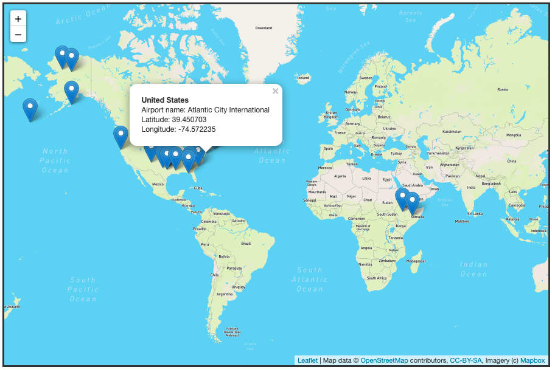

# Post COVID-19 Vacation Planner 

Your gateway to safe Travel

## Purpose 

The project aims to identify and forecast countries that will reach herd immunity by inducing the Arima model on the updated covid fully vaccinated data from our world. The model will evaluate and forecast the future data based on the past and present vaccination rate.

The herd immunity is reached when 70% of the population are fully vaccinated with both the doses.

The people planning to travel in the near future can visit the website ............. and check for a future date for travel to a particular destination, and the model will help them to know the countries that will reach herd immunity and will mark it as safe for travel.

The model will also be fine-tuned for NGOs to know which countries will need help in reaching the herd immunity by providing the details of the earliest date and year by which a particular country can be marked safe for travel. 

NGO's directed by WHO/UN can then send a team with vaccinations and mobile medical unit to vaccinate countries/state who will be ready for such assistance.

## Our Data 
- Data is being used from Our World in Data for all countries but firstly to test our model, we will be using 3 countries. 
- Website: https://ourworldindata.org/covid-vaccinations
-

## Model

### Block Diagram of Arima Model 

-	During the initial investigation of the dataset, it was evaluated that the interval between date entries are not consistent, as some are updated daily and some are updated less frequently; this resulted in plenty of missing value. 
-	To mitigate the problem that would fit best the Arima model, the empty rows are filled using the pivot and melt method. With this method, all the countries would have the same number of entries starting at the original point of December 19th, 2020. 
-	In addition, there are extra inputs on the location that are aggregations of a number of countries. For example, 'world' is added to aggregate the world data. Therefore these entries are dropped.

-	Initial features for the model include:
	- location
	- date
	- people_vaccinated
	- people_fully_vaccinated
	- population
	- population_density
	- gdp_per_capita

- The model of choice is the Autoregressive Integrated Moving Average (ARIMA) model due to the time series nature of the data and the problem. However, the model has its limitations especially for long term forecasting. Since the model puts more weight on its most recent past data, there will be a time that the model will be forecasting based off of its own forecast thus creating a higher margin of error.
- The Arima Model we have worked out for the data works best with p,d,q value of 4,2,4. 
- Checked stationarity: Time series has to be independent of trend or seasonality component before we can use ARIMA to forecast.
- Difference: The time is made stationarized through differencing. We were able to utilize two differening to make the series stationary.
- Filter out a validation sample: This will be used to validate how accurate our model is. We Used train test validation split to achieve this.
- Select AR and MA terms: Use the ACF and PACF to decide whether to include an AR term(s), MA term(s), or both.We settled on P & Q to be at 4 to get the best results 
- Build the model: Build the model and set the number of periods to forecast to N (12*30 days).
- Validate the model: Compare the predicted values to the actuals in the validation sample.

## Examples

- Three countries GBR,USA and ISR were identfied to generate the plots as examples for documentation.
- 
### Plots for GBR

#### Orginal Series and ACF

#### 1st Order differencing and ACF

#### 2nd Order differening and ACF

#### The optimal value of differencing was done with d=2, we used Augmented Dickey–Fuller (ADF) test.

- 
## Database
SQLite
- Script.py is uploaded in the github. It is a script for the database tables using sqllite. 
- Covid19_projection_db file is uploaded in github. We will be using SQLAlchemy.

## Website & Visualizations

Using JavaScript and HTML for front-end development, as well as Leaflet library and other tools to create visual representation of our data and results.

•	Users will be able to input information (e.g. Country they choose to travel to)

• 	Once the user has entered the departure or destination countries, the website will generate when herd immunity will be reached in those countries in 	accordance with our machine learning model. 

•	An interactive map will include popup markers of airports in the chosen countries based on the aviationstack API (https://aviationstack.com/) 

-	The website will also generate a list of flights based on the departure/return date.

-	Users will be notified of travel advisories and whether it is safe to travel to that country. 

-	The user will be able to view further details of how herd immunity was calculate through a graph that reflects COVID-19 vaccination data (percentage of individuals that are fully vaccinated)
-	
-	Website Template: https://whimsical.com/covid-19-Wt8H3eaXMasUUiv68tSpT7 
## Demonstration 

